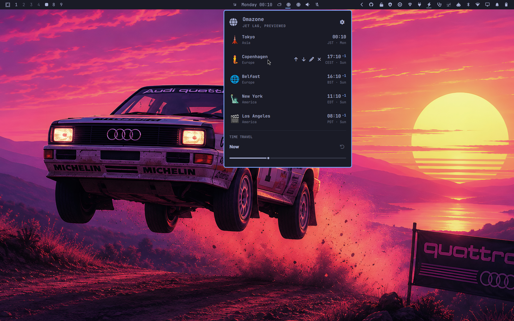

# Omazone

A multi-timezone clock for [Omarchy](https://omarchy.org/) that drops down
from a bar icon. Track any number of cities, each with its own icon and
label, and drag the Time Travel slider to see what time it'll be everywhere
at once.



## Features

- Track any number of IANA timezones, picked by searching real city/region
  names — the list always matches your system's own timezone database.
- Each city gets a fun emoji icon by default (landmarks and local flavor
  where one fits, a globe otherwise), and both the icon and the label are
  editable per city.
- **Time Travel slider** — drag it and every tracked city's clock updates
  together, so you can preview a meeting time or a future moment across all
  of them at once. Shows a +1/−1 badge when a city has rolled into a
  different calendar day than your local time.
- 12-hour or 24-hour display, your choice.
- Reorder cities, or remove ones you no longer need.
- Optional status-bar icon that drops the panel down right under it.

## Install

```
omarchy plugin add https://github.com/weedwhitesandwine/omazone.git --enable
```

Run in a real terminal, this asks which bar section to place the icon in
(left/center/right, right pre-selected) before enabling it — the same
prompt any other bar-widget plugin gives you. Change your mind later from the
panel's **Settings → BAR** section (Left / Center / Right), or from a terminal:

```
omarchy bar move io.github.weedwhitesandwine.omazone --section left
```

The Settings buttons run exactly that `omarchy bar move` command, so the shell
makes the change to its own layout.

Add a keybind, e.g. in `~/.config/hypr/bindings.lua`:

```lua
o.bind("SUPER + I", "Toggle Omazone", "omarchy-shell shell toggle io.github.weedwhitesandwine.omazone")
```

Change it whenever you like — it is an ordinary line in your own config, and
Omazone never touches it.

## Remove

```
omarchy plugin remove io.github.weedwhitesandwine.omazone
```

This deletes the plugin and cleans up its bar icon automatically. Your
tracked cities and settings stay on disk at
`~/.local/state/omarchy/omazone/` unless you remove that directory too.

## Usage

- Open/close: the bar icon, the shortcut you added at install, or
  `omarchy-shell shell toggle io.github.weedwhitesandwine.omazone`.
- Click the gear icon (top-right of the panel) to open settings:
  - **Cities** — search and check off any number of timezones to track.
  - **Format** — 12-hour or 24-hour time.
- On each city row: `↑`/`↓` reorder it, `✎` edit its icon and label, `✕`
  removes it.
- The Time Travel slider ranges from 24 hours in the past to 48 hours
  ahead. The reset icon next to it jumps back to now.

## External dependencies and system-level modifications

This plugin runs `bash`, `date`, `timedatectl`, `jq`, `python3` and `omarchy`
via Quickshell's `Process` — all standard on any Omarchy install, no
extra packages required. `python3` is what reads the settings file back: it
opens it refusing symlinks and anything that is not a plain file, refuses to
wait on a pipe, and reports a file it would not read rather than returning it
empty. Times are computed with the system's own `date`/tzdata,
not looked up over the network — Omazone works fully offline.

**Omazone does not edit your Hyprland configuration.** The shortcut is yours
to add and to change, in `~/.config/hypr/bindings.lua`, using the line in
**Install** above. Nothing in this plugin reads or writes that file.

Outside its own state directory, the only file Omazone writes is
`~/.config/omarchy/shell.json`, and only its own `{"id": …}` entry, when you
show or hide the bar icon from the settings view.

## State files

- `~/.local/state/omarchy/omazone/settings.json` — tracked cities, their
  custom icons/labels and the 12/24-hour preference. Created on
  first change; starts empty until you add cities from Settings.

## License

MIT — see [LICENSE](LICENSE).
